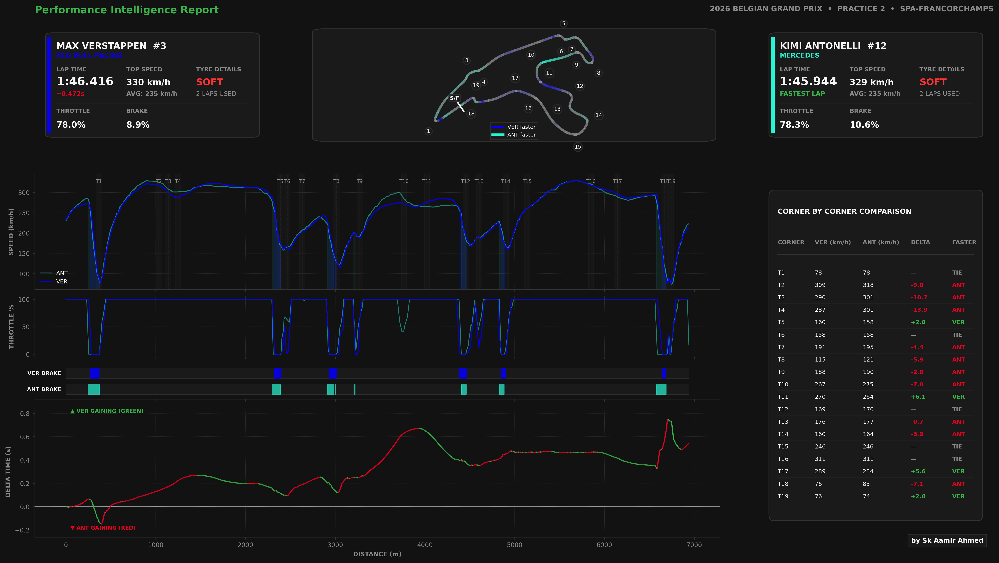

# F1 Telemetry Dashboard

A Python-based Formula 1 telemetry analysis tool that compares two drivers using real session data from FastF1. It transforms raw telemetry into a structured performance report covering speed, throttle, braking, delta time, track position, and corner-by-corner comparisons.

---

## Preview

```


```

---

## Features

- Speed comparison across the full lap
- Throttle trace analysis
- Brake usage comparison
- Delta time visualization
- Track map colored by which driver is faster at each point on circuit
- Corner-by-corner speed comparison table
- Driver performance summary cards
- Multiple visual themes (Carbon, Slate, Light, Retro)
- Desktop and mobile report layouts
- Automatic telemetry interpolation onto a shared distance grid

---

## Tech Stack

- Python
- FastF1
- Pandas
- NumPy
- Matplotlib

---

## Project Structure

```
.
├── dashboard.py
├── driver_cards.py
├── layout.py
├── load_data.py
├── plots.py
├── telemetry.py
├── track_map.py
├── utils.py
├── requirements.txt
├── README.md
└── assets/
```

---

## Installation

Clone the repository:

```bash
git clone https://github.com/Aamir1O/f1-telemetry-dashboard.git
cd f1-telemetry-dashboard
```

Install dependencies:

```bash
pip install -r requirements.txt
```

---

## Usage

**Interactive mode**

```bash
python dashboard.py
```

**Command line**

```bash
python dashboard.py \
    --year 2026 \
    --round 10 \
    --session "Practice 2" \
    --driver-a VER \
    --driver-b ANT
```

**Example**

```bash
python dashboard.py --year 2026 --round 10 --session "Practice 2" --driver-a VER --driver-b ANT
```

---

## Dashboard Components

- Driver information cards
- Track map with performance overlay
- Speed analysis
- Throttle comparison
- Brake analysis
- Delta time
- Corner-by-corner performance table

---

## Example Analysis

**2026 Belgian Grand Prix — Practice 2**

- Driver comparison: Max Verstappen vs. Kimi Antonelli
- Lap time difference: **0.472s**
- Top speed: **330 km/h vs. 329 km/h**

---

## Data Source

Telemetry data is provided by the [FastF1](https://github.com/theOehrly/Fast-F1) project.

---

## Author

**Aamir Ahmed**

LinkedIn: *[(https://www.linkedin.com/in/skaamir10/)](https://www.linkedin.com/in/skaamir10/)*
GitHub: [https://github.com/Aamir1O](https://github.com/Aamir1O)
